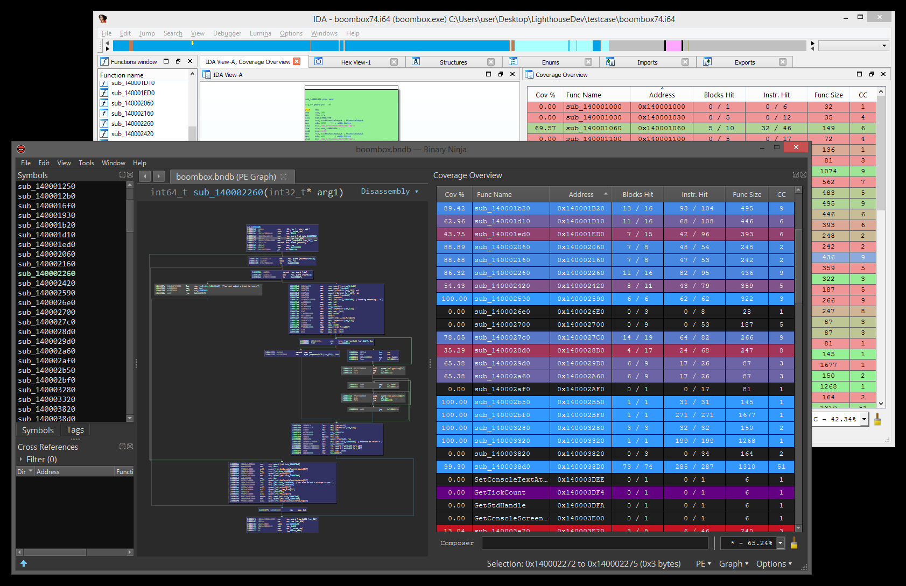

# Lighthouse - A Coverage Explorer for Reverse Engineers

<p align="center">

</p>

## Overview

Lighthouse is a powerful code coverage explorer for [IDA Pro](https://www.hex-rays.com/products/ida/) and [Binary Ninja](https://binary.ninja/), providing software researchers with uniquely interactive controls to study execution maps for native applications without requiring symbols or source.

This project placed 2nd in IDA's [2017 Plug-In Contest](https://hex-rays.com/contests_details/contest2017/) and was later [nominated](https://pwnies.com/lighthouse/) in the 2021 Pwnie Awards for its contributions to the security research industry.

Special thanks to [@0vercl0k](https://twitter.com/0vercl0k) for the inspiration.

## Releases

* v0.9 -- Python 3 support, custom coverage formats, coverage cross-refs, theming subsystem, much more.
* v0.8 -- Binary Ninja support, HTML coverage reports, consistent styling, many tweaks, bugfixes.
* v0.7 -- Frida, C++ demangling, context menu, function prefixing, tweaks, bugfixes.
* v0.6 -- Intel pintool, cyclomatic complexity, batch load, bugfixes.
* v0.5 -- Search, IDA 7 support, many improvements, stability.
* v0.4 -- Most compute is now asynchronous, bugfixes.
* v0.3 -- Coverage composition, interactive composing shell.
* v0.2 -- Multifile support, performance improvements, bugfixes.
* v0.1 -- Initial release

# Installation

Lighthouse is a cross-platform (Windows, macOS, Linux) Python 2/3 plugin. It takes zero third party dependencies, making the code both portable and easy to install.

Use the instructions below for your respective disassembler.

## IDA Installation

1. From IDA's Python console, run the following command to find its plugin directory:
    - `import idaapi, os; print(os.path.join(idaapi.get_user_idadir(), "plugins"))`
2. Copy the contents of this repository's `/plugins/` folder to the listed directory.
3. Restart your disassembler.

## Binary Ninja Installation

Lighthouse can be installed through the plugin manager on Binary Ninja, supporting v3.5 and newer.

1. Open Binary Ninja's plugin manager by navigating the following submenus:
    - `Edit` -> `Preferences` -> `Manage Plugins`
2. Search for Lighthouse in the plugin manager, and click the `Enable` button in the bottom right.
3. Restart your disassembler.

# Usage

Once properly installed, there will be a few new menu entries available in the disassembler. These are the entry points for a user to load coverage data and start using Lighthouse.

<p align="center">

</p>

Lighthouse is able to load a few different 'flavors' of coverage data. To generate coverage data that can be loaded into Lighthouse, please look at the [README](https://github.com/gaasedelen/lighthouse/tree/master/coverage) in the coverage directory of this repository.

## Coverage Painting

While Lighthouse is in use, it will 'paint' the active coverage data across all of the code viewers available in the disassembler. Specifically, this will apply to your linear disassembly, graph, and decompiler windows.

<p align="center">

</p>

In Binary Ninja, only the linear disassembly, graph, and IL views are supported. Support for painting decompiler output in Binary Ninja will be added to Lighthouse in the *near future* as the feature stabilizes.

# Coverage Overview

The Coverage Overview is a dockable widget that will open up once coverage has been loaded into Lighthouse. 

<p align="center">

</p>

This interactive widget provides a function level view of the loaded coverage data. It also houses a number of tools to manage loaded data and drive more advanced forms of coverage analysis. 

## Context Menu

Right clicking the table in the Coverage Overview will produce a context menu with a few basic amenities to extract information from the table, or manipulate the database as part of your reverse engineering process.

<p align="center">

</p>

If there are any other actions that you think might be useful to add to this context menu, please file an issue and they will be considered for a future release of Lighthouse.

## Coverage ComboBox

Loaded coverage and user constructed compositions can be selected or deleted through the coverage combobox.

<p align="center">

</p>

## HTML Coverage Report

Lighthouse can generate rudimentary HTML coverage reports. A sample report can be seen [here](https://rawgit.com/gaasedelen/lighthouse/master/testcase/report.html).

<p align="center">

</p>

# Coverage Shell

At the bottom of the coverage overview window is the coverage shell. This shell can be used to perform logic-based operations that combine or manipulate the loaded coverage sets.

<p align="center">

</p>

This feature is extremely useful in exploring the relationships of program execution across multiple runs. In other words, the shell can be used to 'diff' execution between coverage sets and extract a deeper meaning that is otherwise obscured within the noise of their individual parts.

## Composition Syntax

Coverage composition, or _Composing_ as demonstrated above is achieved through a simple expression grammar and 'shorthand' coverage symbols (A to Z) on the composing shell. 

### Grammar Tokens
* Logical Operators: `|, &, ^, -`
* Coverage Symbol: `A, B, C, ..., Z, *`
* Parenthesis: `(...)`

### Example Compositions

1. Executed code that is *shared* between coverage `A` and coverage `B`:
```
A & B
```

2. Executed code that is *unique* only to coverage `A`:
```
A - B
```

3. Executed code that is *unique* to `A` or `B`, but not `C`:
```
(A | B) - C
```

Expressions can be of arbitrary length or complexity, but the evaluation of the composition may occur right to left. So parenthesis are suggested for potentially ambiguous expressions.

## Hot Shell

Additionally, there is a 'Hot Shell' mode that asynchronously evaluates and caches user compositions in real-time.

<p align="center">

</p>

The hot shell serves as a natural gateway into the unguided exploration of composed relationships.

## Search

Using the shell, you can search and filter the functions listed in the coverage table by prefixing their query with `/`.

<p align="center">

</p>

The head of the shell will show an updated coverage % computed only from the remaining functions. This is useful when analyzing  coverage for specific function families.

## Jump

Entering an address or function name into the shell can be used to jump to corresponding function entries in the table.

<p align="center">

</p>

# Coverage Cross-references (Xref)

While using Lighthouse, you can right click any basic block (or instruction) and use the 'Coverage Xref' action to see which coverage sets executed the selected block. Double clicking any of the listed entries will instantly switch to that coverage set.

<p align="center">

</p>

This pairs well with the 'Coverage Batch' feature, which allows you to quickly load and aggregate thousands of coverage files into Lighthouse. Cross-referencing a block and selecting a 'set' will load the 'guilty' set from disk as a new coverage set for you to explore separate from the batch.

# Themes

Lighthouse ships with two default themes -- a 'light' theme, and a 'dark' one. Depending on the colors currently used by your disassembler, Lighthouse will attempt to select the theme that seems most appropriate.

<p align="center">

</p>

The theme files are stored as simple JSON on disk and are highly configurable. If you are not happy with the default themes or colors, you can create your own themes and simply drop them in the user theme directory.

Lighthouse will remember your theme preference for future loads and uses.

# Future Work

Time and motivation permitting, future work may include:

* ~~Asynchronous composition, painting, metadata collection~~
* ~~Multifile/coverage support~~
* Profiling based heatmaps/painting
* Coverage & profiling treemaps
* ~~Additional coverage sources, trace formats, etc~~
* Improved pseudocode painting
* ~~Lighthouse console access~~, headless usage
* ~~Custom themes~~
* ~~Python 3 support~~

I welcome external contributions, issues, and feature requests. Please make any pull requests to the `develop` branch of this repository if you would like them to be considered for a future release.

# Authors

* Markus Gaasedelen ([@gaasedelen](https://twitter.com/gaasedelen))
