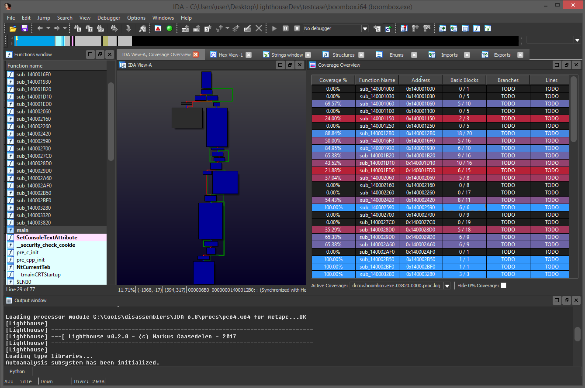
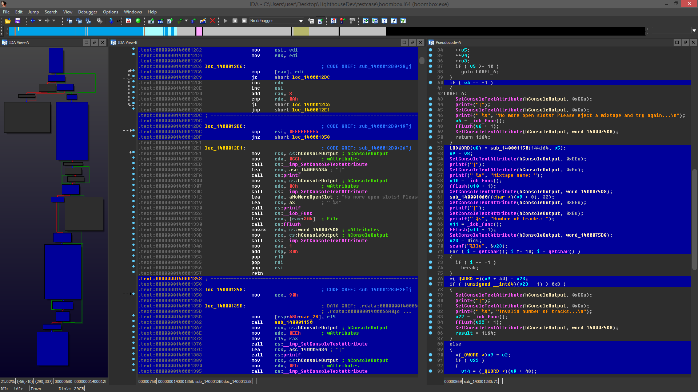
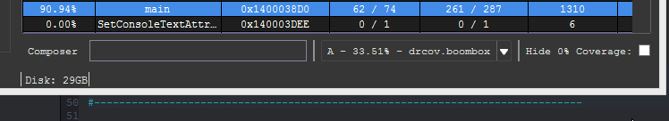
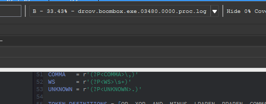
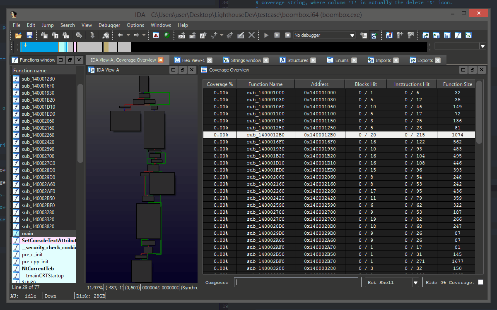

# Lighthouse - Code Coverage Explorer for IDA Pro
<p align="center">

</p>

## Overview

Lighthouse is a Code Coverage Plugin for [IDA Pro](https://www.hex-rays.com/products/ida/). The plugin leverages IDA as a platform to map, explore, and visualize externally collected code coverage data when symbols or source may not be available for a given binary.

This plugin is labeled only as a prototype and IDA / Qt code example for the community. 

Special thanks to [@0vercl0k](https://twitter.com/0vercl0k) for the inspiration.

## Releases

* v0.3 -- Coverage composition, interactive composing shell.
* v0.2 -- Multifile support, perfomance improvements, bugfixes.
* v0.1 -- Initial release

## Installation

Install Lighthouse into the IDA plugins folder.

- Copy the contents of the `plugin` folder to the IDA plugins folder
    - On Windows, the folder is at `C:\Program Files (x86)\IDA 6.8\plugins`
    - On MacOS, the folder is at `/Applications/IDA\ Pro\ 6.8/idaq.app/Contents/MacOS/plugins`
    - On Linux, the folder may be at `/opt/IDA/plugins/`

The plugin has only been tested on IDA Pro 6.8, 6.95 for Windows.

## Usage

Lighthouse loads automatically when an IDB is opened, installing the following menu entries into the IDA interface:

```
- File --> Load file --> Code Coverage File(s)...
- View --> Open subviews --> Coverage Overview
```

These are the entry points for a user to load and view coverage data.

## Coverage Painting

Lighthouse 'paints' the active coverage data across the three major IDA views as applicable. Specifically, the Disassembly, Graph, and Pseudocode views.

<p align="center">

</p>

## Coverage Overview

The Coverage Overview is a dockable widget that provides a function level view of the active coverage data for the database.

<p align="center">

</p>

This table can be sorted by column, and entries can be double clicked to jump to their corresponding disassembly.

## Composing Shell

Building relationships between multiple sets of coverage data often distills deeper meaning than their individual parts. The composing shell is an interactive means of constructing these relationships.

<p align="center">

</p>

Pressing `enter` on the shell will evaluate and save a user constructed composition.

## Composition Syntax

Coverage composition, or _Composing_ as demonstrated above is achieved through a simple expression grammar and 'shorthand' coverage symbols (A to Z) on the composing shell. 

### Grammar Tokens
* Logical Operators: `|, &, ^, -`
* Coverage Symbol: `A, B, C, ..., Z`
* Coverage Range: `A,C`, `Q,Z`, ...
* Parenthesis: `(...)`

### Example Compositions
* `A & B`
* `(A & B) | C`
* `(C & (A - B)) | (F,H & Q)`

The evaluation of the composition may occur right to left, parenthesis are suggested for potentially ambiguous expressions.

## Coverage ComboBox

Loaded coverage data and user constructed compositions can be selected or deleted through the coverage combobox.

<p align="center">

</p>

## Hot Shell (experimental)

Additionally, there is a prototype 'Hot Shell' mode that evaluates user compositions in real-time. This promotes a more natural experience in the unguided exploration of composed relationships.

<p align="center">

</p>

The performance of this feature will be vastly improved in the next release, v0.4.0.

## Collecting Coverage

At this time, Lighthouse only consumes binary coverage data as produced by DynamoRIO's [drcov](http://dynamorio.org/docs/page_drcov.html) code coverage module. 

Collecting blackbox coverage data with `drcov` is relatively straightforward. The following example demonstrates how coverage was produced for the `boombox.exe` testcase provided in this repository.

```
..\DynamoRIO-Windows-7.0.0-RC1\bin64\drrun.exe -t drcov -- boombox.exe
```

This command will produce a `.log` file consisting of the coverage data upon termination of the target application.

## Other Coverage Sources

[drcov](http://dynamorio.org/docs/page_drcov.html) was selected as the initial coverage data source due to its availability, adoption, multi-platform (Win/Mac/Linux), and multi-architecture (x86/AMD64/ARM) support. 

Intel's [PIN](https://software.intel.com/en-us/articles/pin-a-dynamic-binary-instrumentation-tool) for example does not come with a default code coverage pintool. It appears that most implement their own solution and there is no clear format for Lighthouse to standardize on. In the future, Lighthouse may ship with its own pintool.

While Lighthouse is considered a prototype, internally it is largely agnostic of its data source. Future work will hopefully allow one to drop a loader into the `parsers` folder without any need for code changes to Lighthouse. Right now, this is not the case.

## Future Work

Time and motivation permitting, future work may include:

* Asynchronous composition, painting, metadata collection
* ~~Multifile/coverage support~~
* Profiling based heatmaps/painting
* Coverage & Profiling Treemaps
* Automatic parser pickup
* Parsers for additional coverage sources, eg PIN
* Improved Pseudocode painting

## Authors

* Markus Gaasedelen ([@gaasedelen](https://twitter.com/gaasedelen))
