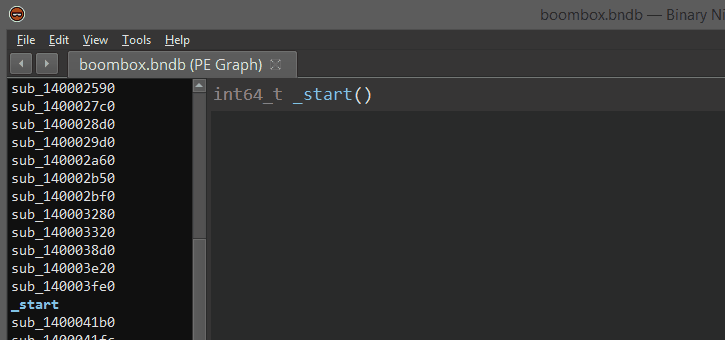

# Lighthouse - A Code Coverage Explorer for Reverse Engineers
<p align="center">

</p>

## Overview

Lighthouse is a code coverage plugin for [IDA Pro](https://www.hex-rays.com/products/ida/), and [Binary Ninja](https://binary.ninja/). The plugin makes use of interactive disassemblers to map, explore, and visualize externally collected code coverage data when symbols or source may not be available for a given binary.

This plugin is labeled only as a prototype & code resource for the community. 

Special thanks to [@0vercl0k](https://twitter.com/0vercl0k) for the inspiration.

## Releases

* v0.8 -- Binary Ninja support, HTML coverage reports, consistent styling, many tweaks, bugfixes.
* v0.7 -- Frida, C++ demangling, context menu, function prefixing, tweaks, bugfixes.
* v0.6 -- Intel pintool, cyclomatic complexity, batch load, bugfixes.
* v0.5 -- Search, IDA 7 support, many improvements, stability.
* v0.4 -- Most compute is now asynchronous, bugfixes.
* v0.3 -- Coverage composition, interactive composing shell.
* v0.2 -- Multifile support, performance improvements, bugfixes.
* v0.1 -- Initial release

# IDA Pro Installation

Lighthouse is a cross-platform (Windows, macOS, Linux) python plugin, supporting IDA Pro 6.8 and newer.

- Copy the contents of the `plugin` folder to the IDA plugins folder
    - On Windows, the folder is at `C:\Program Files (x86)\IDA 6.8\plugins`
    - On macOS, the folder is at `/Applications/IDA\ Pro\ 6.8/idaq.app/Contents/MacOS/plugins`
    - On Linux, the folder may be at `/opt/IDA/plugins/`

(If you need to locate the plugin directory for your setup, just type `idaapi.idadir(idaapi.PLG_SUBDIR)` in IDAPython console)

It has been primarily developed and tested on Windows, so that is where we expect the best experience.

# Binary Ninja Installation (Experimental)

At this time, support for Binary Ninja is considered experimental. Please feel free to report any bugs that you encounter.

You can install Lighthouse & PyQt5 for Binary Ninja by following the instructions below.

## Windows Installation

1. Install PyQt5 from a Windows command prompt with the following command:

```
pip install --target="%appdata%\Binary Ninja\plugins\Lib\site-packages" python-qt5
```

2. Copy the contents of the `/plugin/` folder in this repo to your Binary Ninja [plugins folder](https://docs.binary.ninja/guide/plugins/index.html#using-plugins).

## Linux Installation

1. Install PyQt5 from a Linux shell with the following command:

```
sudo apt install python-pyqt5
```

2. Copy the contents of the `/plugin/` folder in this repo to your Binary Ninja [plugins folder](https://docs.binary.ninja/guide/plugins/index.html#using-plugins).

## macOS Installation

¯\\\_(ツ)\_/¯

# Usage

Lighthouse loads automatically when a database is opened, installing a handful of menu entries into the disassembler.

<p align="center">

</p>

These are the entry points for a user to load and view coverage data.

## Coverage Painting

Lighthouse 'paints' the active coverage data across the three major IDA views as applicable. Specifically, the Disassembly, Graph, and Pseudocode views.

<p align="center">

</p>

In Binary Ninja, only the Disassembly and Graph views are supported.

## Coverage Overview

The Coverage Overview is a dockable widget that provides a function level view of the active coverage data for the database.

<p align="center">

</p>

This table can be sorted by column, and entries can be double clicked to jump to their corresponding disassembly.

## Context Menu

Right clicking the table in the Coverage Overview will produce a context menu with a few basic amenities.

<p align="center">

</p>

These actions can be used to quickly manipulate or interact with entries in the table.

## Coverage Composition

Building relationships between multiple sets of coverage data often distills deeper meaning than their individual parts. The shell at the bottom of the [Coverage Overview](#coverage-overview) provides an interactive means of constructing these relationships.

<p align="center">

</p>

Pressing `enter` on the shell will evaluate and save a user constructed composition.

## Composition Syntax

Coverage composition, or _Composing_ as demonstrated above is achieved through a simple expression grammar and 'shorthand' coverage symbols (A to Z) on the composing shell. 

### Grammar Tokens
* Logical Operators: `|, &, ^, -`
* Coverage Symbol: `A, B, C, ..., Z`
* Coverage Range: `A,C`, `Q,Z`, ...
* Parenthesis: `(...)`

### Example Compositions
* `A & B`
* `(A & B) | C`
* `(C & (A - B)) | (F,H & Q)`

The evaluation of the composition may occur right to left, parenthesis are suggested for potentially ambiguous expressions.

## Hot Shell

Additionally, there is a 'Hot Shell' mode that asynchronously evaluates and caches user compositions in real-time.

<p align="center">

</p>

The hot shell serves as a natural gateway into the unguided exploration of composed relationships.

## Search

Using the shell, one can search and filter the functions listed in the coverage table by prefixing their query with `/`.

<p align="center">

</p>

The head of the shell will show an updated coverage % computed only from the remaining functions. This is useful when analyzing  coverage for specific function families.

## Jump

Entering an address or function name into the shell can be used to jump to corresponding function entries in the table.

<p align="center">

</p>

## Coverage ComboBox

Loaded coverage data and user constructed compositions can be selected or deleted through the coverage combobox.

<p align="center">

</p>

## HTML Coverage Report

Lighthouse can generate a rudimentary HTML coverage report of the active coverage. 
A sample report can be seen [here](https://rawgit.com/gaasedelen/lighthouse/master/testcase/report.html).

<p align="center">

</p>

# Collecting Coverage

Before using Lighthouse, one will need to collect code coverage data for their target binary / application.

The examples below demonstrate how one can use [DynamoRIO](http://www.dynamorio.org), [Intel Pin](https://software.intel.com/en-us/articles/pin-a-dynamic-binary-instrumentation-tool) or [Frida](https://www.frida.re) to collect Lighthouse compatible coverage against a target. The `.log` files produced by these instrumentation tools can be loaded directly into Lighthouse.

## DynamoRIO

Code coverage data can be collected via DynamoRIO's [drcov](http://dynamorio.org/docs/page_drcov.html) code coverage module. 

Example usage:

```
..\DynamoRIO-Windows-7.0.0-RC1\bin64\drrun.exe -t drcov -- boombox.exe
```

## Intel Pin

Using a [custom pintool](coverage/pin) contributed by [Agustin Gianni](https://twitter.com/agustingianni), the Intel Pin DBI can also be used to collect coverage data.

Example usage:

```
pin.exe -t CodeCoverage64.dll -- boombox.exe
```

For convenience, binaries for the Windows pintool can be found on the [releases](https://github.com/gaasedelen/lighthouse/releases) page. macOS and Linux users need to compile the pintool themselves following the [instructions](coverage/pin#compilation) included with the pintool for their respective platforms.

## Frida (Experimental)

Lighthouse offers limited support for Frida based code coverage via a custom [instrumentation script](coverage/frida) contributed by [yrp](https://twitter.com/yrp604). 

Example usage:

```
sudo python frida-drcov.py bb-bench
```

# Future Work

Time and motivation permitting, future work may include:

* ~~Asynchronous composition, painting, metadata collection~~
* ~~Multifile/coverage support~~
* Profiling based heatmaps/painting
* Coverage & profiling treemaps
* ~~Additional coverage sources, trace formats, etc~~
* Improved pseudocode painting
* ~~Lighthouse console access~~, headless usage
* ~~Custom themes~~
* ~~Python 3 support~~

I welcome external contributions, issues, and feature requests. Please make any pull requests to the `develop` branch of this repo.

# Authors

* Markus Gaasedelen ([@gaasedelen](https://twitter.com/gaasedelen))
